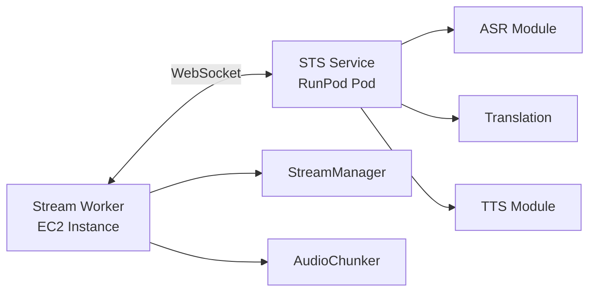
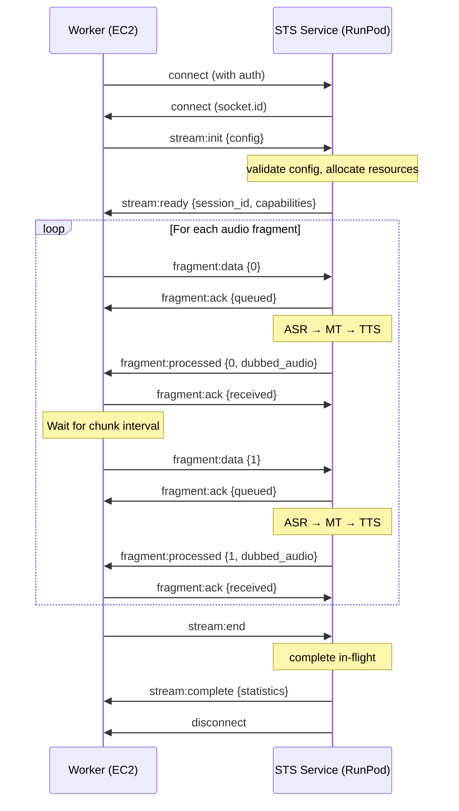
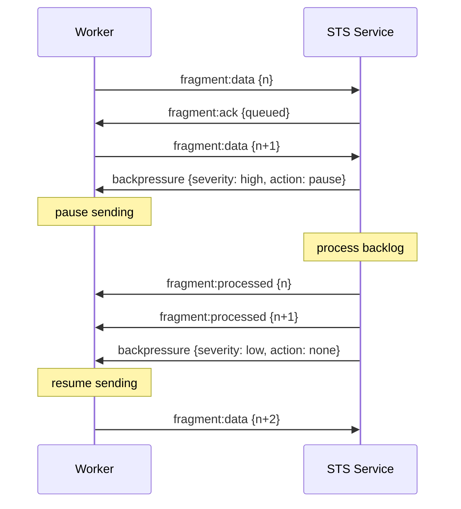
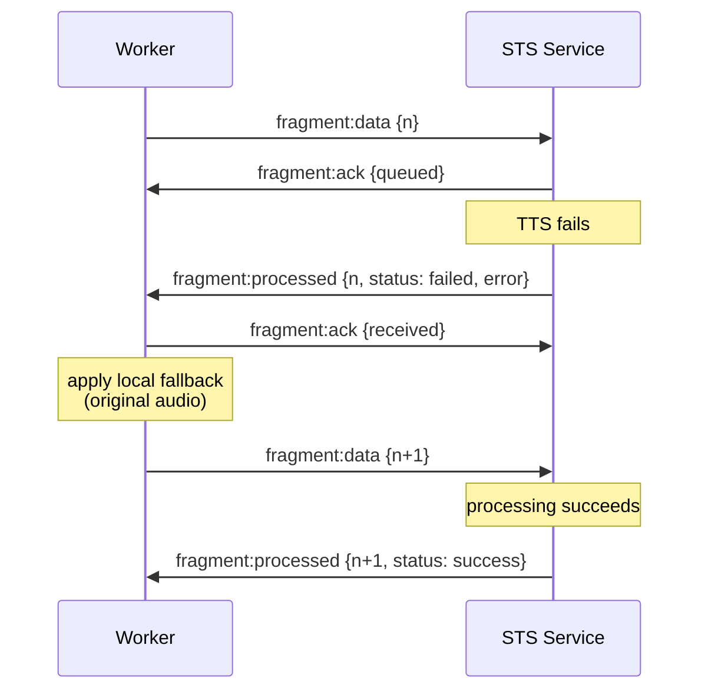

# 016 — WebSocket Audio Fragment Protocol Specification

Status: Draft
Last updated: 2025-12-24

## 1. Overview

The WebSocket Audio Fragment Protocol defines a bidirectional, real-time communication channel for streaming audio fragments between the **Stream Worker** (EC2) and **STS Service** (RunPod) in the live broadcast dubbing pipeline.

**Protocol Version:** 1.0
**Transport:** Socket.IO over WebSocket
**Primary Use Case:** Low-latency, bidirectional audio fragment streaming with backpressure and ordering guarantees

---

## 2. Motivation

While the HTTP/REST API (defined in [specs/015-deployment-architecture.md](./015-deployment-architecture.md)) is the primary integration method, this WebSocket protocol provides:

- **Lower latency**: Persistent connection eliminates HTTP handshake overhead per fragment
- **Bidirectional streaming**: STS can push processed fragments as soon as ready
- **Backpressure signaling**: Real-time flow control prevents queue overflow
- **Connection state awareness**: Detect network issues faster than HTTP timeouts
- **Batch processing**: Optional grouped fragment delivery for efficiency

**When to use WebSocket vs HTTP**:
- Use **WebSocket** for: sustained streaming sessions with predictable fragment flow
- Use **HTTP/REST** for: on-demand processing, testing, and fault isolation

---

## 3. Architecture



**Connection Model**:
- One WebSocket connection per stream
- Connection lifecycle managed by Stream Worker
- STS Service acts as server, Worker as client

---

## 4. Connection Lifecycle

### 4.1 Establish Connection

**Flow**:
1. Worker initiates WebSocket connection to `wss://<runpod-id>.runpod.io/ws/sts`
2. Worker sends `stream:init` with stream metadata and configuration
3. STS responds with `stream:ready` or `error`
4. Connection ready for bidirectional fragment exchange

**Socket.IO Configuration**:
- **Max buffer size**: 50MB (large enough for base64-encoded audio)
- **Reconnection**: Enabled with exponential backoff (max 3 retries)
- **Ping interval**: 25s (detect dead connections)
- **Ping timeout**: 10s
- **Upgrade timeout**: 10s
- **Transport**: WebSocket preferred, no fallback to polling

### 4.2 Authentication

**API Key Authentication**:
```typescript
io.connect(url, {
  auth: {
    token: process.env.STS_API_KEY
  },
  extraHeaders: {
    'X-Stream-ID': streamId,
    'X-Worker-ID': workerId
  }
})
```

**Server Validation**:
- Verify API key on connection handshake
- Reject unauthorized connections immediately
- Rate limit connection attempts per API key

---

## 5. Message Types

### 5.1 Worker → STS Events

#### `stream:init`
Initialize a new streaming session.

**Payload**:
```typescript
{
  stream_id: string;                // Unique stream identifier
  worker_id: string;                // Worker instance identifier
  config: {
    source_language: string;        // Source language code (e.g., "en")
    target_language: string;        // Target language code (e.g., "es")
    voice_profile: string;          // TTS voice identifier
    chunk_duration_ms: number;      // Expected fragment duration
    sample_rate_hz: number;         // Audio sample rate (e.g., 48000)
    channels: number;               // Audio channels (1=mono, 2=stereo)
    format: string;                 // Audio format (e.g., "pcm_s16le")
  };
  max_inflight?: number;            // Max concurrent fragments (default: 3)
  timeout_ms?: number;              // Per-fragment timeout (default: 8000)
}
```

**Response**: `stream:ready` on success, `error` on failure

---

#### `fragment:data`
Send an audio fragment for processing.

**Payload**:
```typescript
{
  fragment_id: string;              // Unique fragment ID (UUID)
  stream_id: string;                // Stream identifier
  sequence_number: number;          // Monotonic sequence (0-based)
  timestamp: number;                // Unix timestamp (ms)
  audio: {
    format: string;                 // "pcm_s16le"
    sample_rate_hz: number;         // Sample rate (e.g., 48000)
    channels: number;               // Number of channels
    duration_ms: number;            // Fragment duration
    data_base64: string;            // Base64-encoded audio data
  };
  metadata?: {                      // Optional metadata
    pts_ns: number;                 // Presentation timestamp (nanoseconds)
    source_pts_ns: number;          // Original input PTS
    [key: string]: any;             // Additional metadata
  };
}
```

**Response**: `fragment:ack` (immediate), then `fragment:processed` (when ready)

---

#### `fragment:ack`
Acknowledge receipt of a processed fragment.

**Payload**:
```typescript
{
  fragment_id: string;              // Fragment ID from STS
  status: 'received' | 'applied';   // Worker processing status
  timestamp: number;                // Acknowledgment timestamp
}
```

**Purpose**: Allows STS to track delivery success and adjust flow control

---

#### `stream:pause`
Request temporary pause of fragment processing.

**Payload**:
```typescript
{
  stream_id: string;
  reason?: string;                  // Optional reason (e.g., "backpressure")
}
```

**Behavior**:
- STS completes in-flight fragments but accepts no new fragments
- Worker can resume with `stream:resume`

---

#### `stream:resume`
Resume fragment processing after pause.

**Payload**:
```typescript
{
  stream_id: string;
}
```

---

#### `stream:end`
Signal end of stream (graceful shutdown).

**Payload**:
```typescript
{
  stream_id: string;
  reason?: string;                  // Optional reason (e.g., "source_ended")
}
```

**Response**: `stream:complete` when all in-flight fragments are processed

---

### 5.2 STS → Worker Events

#### `stream:ready`
Confirms successful stream initialization.

**Payload**:
```typescript
{
  stream_id: string;
  session_id: string;               // Server-assigned session ID
  max_inflight: number;             // Confirmed max concurrent fragments
  capabilities: {                   // Server capabilities
    batch_processing: boolean;
    async_delivery: boolean;
  };
}
```

---

#### `fragment:ack`
Acknowledge receipt of a fragment (immediate).

**Payload**:
```typescript
{
  fragment_id: string;
  status: 'queued' | 'processing';
  queue_position?: number;          // Position in processing queue
  estimated_completion_ms?: number; // Estimated processing time
}
```

---

#### `fragment:processed`
Deliver a processed audio fragment.

**Payload**:
```typescript
{
  fragment_id: string;              // Original fragment ID
  stream_id: string;
  sequence_number: number;          // Original sequence number
  status: 'success' | 'partial' | 'failed';

  // Processing results (if successful)
  dubbed_audio?: {
    format: string;                 // "pcm_s16le"
    sample_rate_hz: number;         // Sample rate
    channels: number;               // Channels
    duration_ms: number;            // Actual duration
    data_base64: string;            // Base64-encoded audio
  };

  // Intermediate results (optional)
  transcript?: string;              // ASR output
  translated_text?: string;         // MT output

  // Processing metadata
  processing_time_ms: number;       // Total processing time
  stage_timings?: {                 // Per-stage breakdown
    asr_ms: number;
    translation_ms: number;
    tts_ms: number;
  };

  // Error information (if failed/partial)
  error?: {
    code: string;                   // Error code
    message: string;                // Error description
    stage: 'asr' | 'translation' | 'tts';
    retryable: boolean;
  };

  // Model metadata
  metadata?: {
    asr_model: string;
    translation_model: string;
    tts_model: string;
    gpu_utilization?: number;
  };
}
```

---

#### `stream:complete`
All fragments processed, stream ending gracefully.

**Payload**:
```typescript
{
  stream_id: string;
  total_fragments: number;          // Total fragments processed
  total_duration_ms: number;        // Total stream duration
  statistics: {
    success_count: number;
    partial_count: number;
    failed_count: number;
    avg_processing_time_ms: number;
    p95_processing_time_ms: number;
  };
}
```

**Behavior**: Connection remains open for final acknowledgments, then auto-closes after 5s

---

#### `backpressure`
Signal that STS is experiencing high load.

**Payload**:
```typescript
{
  stream_id: string;
  severity: 'low' | 'medium' | 'high';
  current_inflight: number;
  queue_depth: number;
  action: 'slow_down' | 'pause' | 'none';
  recommended_delay_ms?: number;    // Suggested delay before next fragment
}
```

**Worker Action**:
- `slow_down`: Increase interval between fragment submissions
- `pause`: Stop sending new fragments until backpressure clears
- `none`: Informational only

---

#### `error`
Report errors during operations.

**Payload**:
```typescript
{
  error_id?: string;                // Unique error identifier
  stream_id?: string;
  fragment_id?: string;
  code: string;                     // Error code (see §8)
  message: string;                  // Human-readable description
  severity: 'warning' | 'error' | 'fatal';
  retryable: boolean;
  metadata?: Record<string, any>;
}
```

---

#### `disconnect`
Connection closed.

**Parameters**:
```typescript
reason: string;
description?: string;
```

**Common Reasons**:
- `"io server disconnect"` - Server-initiated shutdown
- `"transport close"` - Network disconnection
- `"client namespace disconnect"` - Worker initiated
- `"ping timeout"` - Connection lost (no heartbeat)

---

## 6. Protocol Flow

### 6.1 Happy Path (Standard Flow)



### 6.2 Backpressure Flow



### 6.3 Error Recovery Flow



---

## 7. Ordering and Concurrency Guarantees

### 7.1 Fragment Ordering

**Server-side guarantees**:
- Fragments may be processed **out of order** internally (concurrent execution)
- `fragment:processed` events are emitted **in sequence_number order**
- Worker receives fragments in the correct playback order

**Implementation requirement**:
- STS maintains an output buffer that holds completed fragments until their predecessors are sent

### 7.2 Concurrency Control

**Max In-Flight Fragments**:
```typescript
// Configured during stream:init
max_inflight: 3  // Default

// Worker enforces:
if (inflightCount >= maxInflight) {
  await waitForFragmentCompletion();
}
sendFragment(nextFragment);
```

**Worker Responsibilities**:
- Track in-flight fragments (sent but not yet received `fragment:processed`)
- Apply backpressure locally when max in-flight reached
- Handle out-of-order completion (reorder before audio mixer)

---

## 8. Error Handling

### 8.1 Error Codes

| Code | Severity | Retryable | Description |
|------|----------|-----------|-------------|
| `AUTH_FAILED` | fatal | No | Invalid API key |
| `STREAM_NOT_FOUND` | error | No | Unknown stream_id |
| `INVALID_CONFIG` | error | No | Invalid stream:init config |
| `FRAGMENT_TOO_LARGE` | error | No | Fragment exceeds size limit |
| `TIMEOUT` | error | Yes | Processing timeout |
| `MODEL_ERROR` | error | Yes | ASR/MT/TTS model failure |
| `GPU_OOM` | error | Yes | Out of GPU memory |
| `QUEUE_FULL` | warning | Yes | Processing queue full |
| `INVALID_SEQUENCE` | error | No | Sequence number gap detected |
| `RATE_LIMIT` | warning | Yes | Too many requests |

### 8.2 Worker Error Handling

**Connection Errors**:
- `connect_error`: Log and retry with exponential backoff (max 3 attempts)
- `disconnect` (unexpected): Attempt reconnection with session resume
- `ping timeout`: Reconnect and reinitialize stream

**Fragment Errors**:
- `TIMEOUT`: Retry once, then apply configured fallback (pass-through)
- `MODEL_ERROR`: Retry once if retryable, else apply fallback
- `QUEUE_FULL`: Apply local backpressure, wait for `backpressure` event

**Fatal Errors**:
- `AUTH_FAILED`: Log error, exit worker (requires manual intervention)
- `INVALID_CONFIG`: Log error, fail stream initialization

### 8.3 Server Error Handling

**Resource Exhaustion**:
- Emit `backpressure` event before rejecting fragments
- Return `QUEUE_FULL` error if backpressure ignored
- Close connection if worker continues to violate flow control

**Model Failures**:
- Return `fragment:processed` with `status: failed` and error details
- Continue processing subsequent fragments (isolation)
- Alert if failure rate exceeds threshold (5% over 1 minute)

---

## 9. Performance Characteristics

### 9.1 Latency Targets

| Metric | Target | Notes |
|--------|--------|-------|
| Connection establishment | < 500ms | Including TLS handshake |
| `stream:init` → `stream:ready` | < 1s | Model warm-up included |
| Fragment acknowledgment | < 50ms | Immediate after receipt |
| Total fragment RTT | 2-6s | Includes ASR+MT+TTS |
| In-order delivery delay | < 200ms | Buffering overhead |

### 9.2 Throughput

**Single connection**:
- Sustained: 1 fragment/sec (1s chunks)
- Burst: Up to `max_inflight` concurrent fragments
- Max bandwidth: ~500 KB/s per stream (48kHz stereo PCM, base64-encoded)

**Server capacity**:
- Concurrent streams: Limited by GPU memory (typically 4-8 per pod)
- Fragments/sec: 4-8 (one per stream, pipelined)

---

## 10. Configuration Reference

### 10.1 Environment Variables (Worker)

```env
# WebSocket connection
STS_WS_URL=wss://<runpod-id>.runpod.io/ws/sts
STS_API_KEY=<secret>

# Connection behavior
STS_WS_RECONNECT_ATTEMPTS=3
STS_WS_RECONNECT_DELAY_MS=1000
STS_WS_PING_INTERVAL_MS=25000
STS_WS_PING_TIMEOUT_MS=10000

# Flow control
STS_MAX_INFLIGHT=3
STS_FRAGMENT_TIMEOUT_MS=8000
STS_BACKPRESSURE_THRESHOLD=0.8
```

### 10.2 Environment Variables (STS Service)

```env
# WebSocket server
WS_PORT=8000
WS_MAX_CONNECTIONS=10
WS_MAX_BUFFER_SIZE=52428800  # 50MB

# Processing
GPU_MAX_BATCH_SIZE=4
PROCESSING_TIMEOUT_MS=10000
QUEUE_MAX_DEPTH=20

# Authentication
API_KEY=<secret>
REQUIRE_AUTH=true
```

---

## 11. Security Considerations

### 11.1 Authentication & Authorization

- **API key authentication**: Required on connection handshake
- **Per-stream authorization**: Validate worker permissions for stream_id
- **Rate limiting**: Max 10 connections per API key, 100 fragments/min per stream

### 11.2 Data Protection

- **TLS required**: All connections use WSS (WebSocket Secure)
- **No logging of audio data**: Audio payloads not logged by default
- **Metadata sanitization**: Strip sensitive fields before logging

### 11.3 Resource Protection

- **Connection limits**: Max concurrent connections per pod
- **Fragment size limits**: Max 10MB per fragment (base64-encoded)
- **Queue depth limits**: Max 20 fragments per stream in queue
- **Timeout enforcement**: Force-close idle connections after 60s

---

## 12. Monitoring & Observability

### 12.1 Worker Metrics

**Counters**:
- `ws_fragments_sent_total{stream_id, status}`
- `ws_fragments_received_total{stream_id, status}`
- `ws_errors_total{error_code, retryable}`
- `ws_reconnections_total{reason}`

**Gauges**:
- `ws_connection_state{stream_id}` (0=disconnected, 1=connected)
- `ws_inflight_fragments{stream_id}`
- `ws_backpressure_severity{stream_id}` (0=none, 1=low, 2=medium, 3=high)

**Histograms**:
- `ws_fragment_rtt_ms{stream_id}`
- `ws_fragment_processing_time_ms{stream_id, stage}`
- `ws_reconnection_delay_ms`

### 12.2 Server Metrics

**Counters**:
- `ws_connections_total{status}` (accepted, rejected)
- `ws_fragments_processed_total{stream_id, status}`
- `ws_errors_total{error_code, stream_id}`

**Gauges**:
- `ws_active_connections`
- `ws_active_streams`
- `ws_queue_depth{stream_id}`
- `ws_gpu_utilization_percent`

**Histograms**:
- `ws_fragment_processing_ms{stage}` (asr, mt, tts, total)
- `ws_queue_wait_time_ms{stream_id}`
- `ws_batch_size` (if batch processing enabled)

---

## 13. Migration from HTTP/REST

### 13.1 Incremental Adoption

**Phase 1: HTTP-only** (Current)
- All fragment processing via `POST /api/v1/sts/process`
- Simple, stateless, easy to debug

**Phase 2: Dual-mode support**
- Support both HTTP and WebSocket endpoints
- Worker configurable via `STS_PROTOCOL=http|ws`
- Side-by-side comparison of latency/throughput

**Phase 3: WebSocket-preferred**
- Default to WebSocket for sustained streams
- Fallback to HTTP on WebSocket failures
- Deprecate HTTP for new deployments

### 13.2 Compatibility Layer

**Adapter Pattern**:
```typescript
interface STSClient {
  processFragment(request: FragmentRequest): Promise<FragmentResult>;
}

class HTTPSTSClient implements STSClient { /* ... */ }
class WebSocketSTSClient implements STSClient { /* ... */ }

// Worker uses interface, swappable at runtime
const stsClient: STSClient = config.protocol === 'ws'
  ? new WebSocketSTSClient(config)
  : new HTTPSTSClient(config);
```

---

## 14. Testing Strategy

### 14.1 Unit Tests

- Mock Socket.IO client/server for message validation
- Test event serialization/deserialization
- Verify error code mappings

### 14.2 Integration Tests

- Local Socket.IO server with mock STS backend
- Test full connection lifecycle (init → fragments → end)
- Test backpressure and flow control
- Test reconnection and session resume

### 14.3 Load Tests

- Simulate multiple concurrent streams
- Measure max sustained throughput
- Verify ordering under high load
- Test graceful degradation under GPU saturation

---

## 15. Acceptance Criteria

- [ ] Worker can establish WebSocket connection with API key auth
- [ ] Stream initialization succeeds with valid configuration
- [ ] Fragments are processed and delivered in sequence_number order
- [ ] Backpressure events prevent queue overflow
- [ ] Reconnection preserves session state (in-flight fragments)
- [ ] Error handling matches HTTP/REST behavior (same fallbacks)
- [ ] End-to-end latency < 6s (p95) for sustained streaming
- [ ] Connection overhead < 500ms (one-time cost)
- [ ] All events logged with correlation IDs (stream_id, fragment_id)

---

## 16. Open Questions

**Resolved**:
1. **Session resume**: Should reconnection attempt to resume in-flight fragments?
   - **Decision**: Yes, worker retransmits unacknowledged fragments after reconnect

2. **Batch processing**: Should STS support batched fragment delivery?
   - **Decision**: No in v1; optimize single-fragment latency first

3. **Heartbeat strategy**: Custom heartbeat or rely on Socket.IO ping/pong?
   - **Decision**: Use Socket.IO built-in ping/pong (25s interval)

**Pending**:
1. Should worker support multiple concurrent streams per WebSocket connection?
   - Current: One connection per stream (simpler isolation)
   - Alternative: Multiplexed connection with stream_id routing

2. How to handle partial GPU failures (e.g., TTS only)?
   - Current: Return `status: partial` with available results
   - Alternative: Define degraded mode configurations

---

## 17. Version History

- **v1.0** (2025-12-24): Initial WebSocket protocol specification for live broadcast dubbing

---

## 18. References

- [specs/001-spec.md](./001-spec.md) - Overall system architecture
- [specs/003-gstreamer-stream-worker.md](./003-gstreamer-stream-worker.md) - Stream worker design
- [specs/004-sts-pipeline-design.md](./004-sts-pipeline-design.md) - STS pipeline contracts
- [specs/015-deployment-architecture.md](./015-deployment-architecture.md) - HTTP/REST API specification
- [Socket.IO Client API](https://socket.io/docs/v4/client-api/)
- [Socket.IO Server API](https://socket.io/docs/v4/server-api/)
